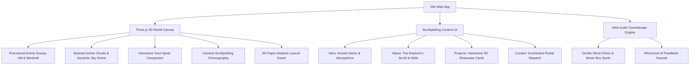

# Ghibli-Themed Modern 3D Portfolio Demo

Build a modern, breathtaking 3D portfolio demo inspired by the art, aesthetics, and wonder of **Studio Ghibli** (Spirited Away, Howl's Moving Castle, My Neighbor Totoro, Castle in the Sky). The portfolio starts with the user's name (**Kunshi**), seamlessly flows into an interactive **About** journey, showcases curated **Projects** with interactive depth, and finalizes with an enchanted **Contact** carrier-pigeon / paper airplane dispatch experience.

---

## User Review Required

> [!IMPORTANT]
> - **Tech Stack**: Built with **Vite + Modern Vanilla JavaScript + Vanilla CSS + Three.js**. This delivers 60 FPS GPU-accelerated 3D rendering with zero framework bloat, fast load times, and custom painterly cel-shaders.
> - **All Free & Self-Contained Resources**: No paid assets or brittle external CDN dependencies. All 3D assets, cel-shading, swaying meadow grass, anime clouds, soot sprites, and ambient Ghibli music box chimes are procedurally synthesized in-engine via Three.js and the Web Audio API.
> - **Name & Customization**: The hero is personalized for **Kunshi** (Creative Technologist & 3D Web Engineer), with an interactive time-of-day switcher (Day, Golden Sunset, Starlit Night) and quick-edit profile modal so you can tweak details on the fly.

---

## Architecture & Visual System

### Aesthetic Pillars
1. **Studio Ghibli Palette**:
   - **Day**: Vibrant meadow greens (`#489a6d`, `#7cc98b`), Laputa sky azure (`#65a5d1`), cloud whites, sunflower gold accents.
   - **Sunset**: Howl's golden amber (`#ff9a5c`), dusk violet (`#4c3b71`), warm rose highlights.
   - **Night**: Spirited Away midnight indigo (`#0e1224`), bioluminescent firefly glow (`#6ee7b7`), warm lantern amber (`#fcd34d`).
2. **Typography**: Google Fonts pairing — *Cinzel Decorative / Cormorant Garamond* for titles, paired with *Plus Jakarta Sans* for clean, modern readability.
3. **Materials & Shaders**: Stylized anime cel-shading, gentle vertex-shader wind movement on grass blades and petals, watercolor card backdrops with glassmorphic borders.

---

## Proposed Changes

### Project Scaffolding & Setup

#### [NEW] [package.json](file:///c:/Users/KunshiNS/OneDrive%20-%20Tsecond%20Inc/Desktop/new%20invention/3/package.json)
- Project config with `three` for 3D graphics, `lucide` for modern icons, and `vite` for development and bundling.

#### [NEW] [index.html](file:///c:/Users/KunshiNS/OneDrive%20-%20Tsecond%20Inc/Desktop/new%20invention/3/index.html)
- Semantic HTML5 structure with SEO meta tags, Google Fonts preconnects, fixed WebGL canvas container, HUD overlays, audio toggle, and the 4 primary sections:
  1. `#hero` — Hero banner starting with **Kunshi**, subtitle, status badge, call-to-actions, and time-of-day switcher.
  2. `#about` — Ghibli parchment storytelling layout, interactive skill scrolls, milestone cards, and film-inspired philosophy.
  3. `#projects` — 3D interactive showcase cards with tags, modal detail previews, and live demo actions.
  4. `#contact` — Postal stamp letter interface with an interactive 3D paper airplane launch animation on send.
  5. `#footer` — Floating spirit balloon, credit, and smooth scroll to top.

---

### Core Styling & Design System

#### [NEW] [src/style.css](file:///c:/Users/KunshiNS/OneDrive%20-%20Tsecond%20Inc/Desktop/new%20invention/3/src/style.css)
- CSS custom properties (variables) for theme modes (Day, Sunset, Night).
- Glassmorphic card styling with hand-crafted paper borders and watercolor tint effects.
- Parallax & scrollytelling layout following modern web best practices (using compositor-friendly `transform` and `opacity`).
- Custom cursor with Ghibli soot sprite / dust-bunny trail.
- Responsive breakpoints for mobile, tablet, and widescreen displays.

---

### 3D Engine & Scene Graph

#### [NEW] [src/three/scene.js](file:///c:/Users/KunshiNS/OneDrive%20-%20Tsecond%20Inc/Desktop/new%20invention/3/src/three/scene.js)
- Three.js setup: Perspective camera, WebGLRenderer with antialiasing and tone mapping.
- **Lighting & Atmosphere**: Directional sun/moon light, hemisphere ambient light, and dynamic fog that adapts to the time-of-day.
- **Floating Island & Hill**: Low-poly lush grassy knoll with animated blades of grass swaying in the wind.
- **Ghibli Windmill & Lantern**: Cel-shaded cottage/windmill with spinning blades and warm glowing lantern.
- **Anime Clouds**: Volumetric stylized cloud clusters drifting lazily in the sky.
- **Particle System**: Drifting cherry blossom petals, dandelion fluffs, and floating night fireflies.
- **Interactive Soot Sprite**: Cute 3D creature with blinking round eyes that tilts and curiously follows the mouse.
- **Camera Scroll Controller**: Smooth interpolation (`lerp`) tying the camera position, rotation, and target to page scroll progression.
- **3D Paper Airplane**: Spawns and animates soaring across the landscape when the contact form is submitted.

---

### Audio Synthesizer (Zero External Dependencies)

#### [NEW] [src/audio/ghibliSound.js](file:///c:/Users/KunshiNS/OneDrive%20-%20Tsecond%20Inc/Desktop/new%20invention/3/src/audio/ghibliSound.js)
- Procedural Web Audio API sound generator:
  - Soothing Joe Hisaishi / Ghibli-inspired pentatonic music box chimes on interactions.
  - Soft ambient wind generator.
  - Paper rustle and whimsical flight swoosh on form submission.
  - User-controlled audio toggle (starts muted for accessibility, saves state).

---

### Interactive UI Logic

#### [NEW] [src/main.js](file:///c:/Users/KunshiNS/OneDrive%20-%20Tsecond%20Inc/Desktop/new%20invention/3/src/main.js)
- Coordinates the 3D scene, scrollytelling events, form handling, project modals, audio triggers, and time-of-day controls.
- Interactive project showcase modal with live details, tech stack info, and preview interactions.
- Contact form handling with validation, spirit letter animation, and paper airplane flight trigger.

---

## Verification Plan

### Automated & Build Checks
- Install dependencies: `npm install`
- Type/Syntax & Build validation: `npm run build` to verify clean bundle creation with zero warnings/errors.

### Interactive Verification
- Start local development server with `npm run dev`.
- Verify in browser:
  1. **Hero Section**: Displays "Kunshi" with animated 3D Ghibli world and soot sprite cursor tracking.
  2. **Time of Day Switching**: Toggle between Day, Golden Sunset, and Starlit Night; confirm smooth color and lighting transitions.
  3. **Scrollytelling**: Scroll down through About, Projects, and Contact; verify camera smoothly glides and angles adjust seamlessly.
  4. **Audio Engine**: Click audio toggle; verify soft pentatonic chimes play on hover/click.
  5. **Project Cards**: Inspect project cards and open interactive modal preview.
  6. **Contact Form**: Fill out and submit the form; verify 3D paper airplane launches into the sky with celebratory animation.
